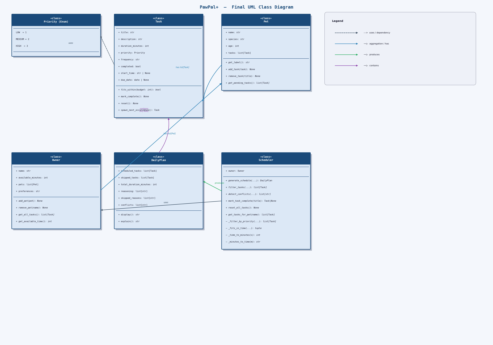
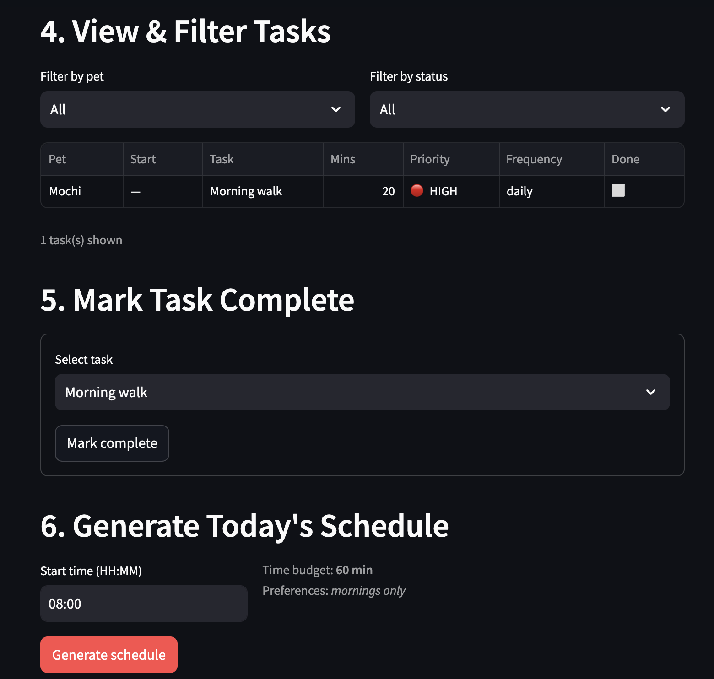

# PawPal+

A pet care planning assistant built with Python and Streamlit. PawPal+ helps busy pet owners stay consistent with daily pet care by generating a prioritized, time-aware schedule across multiple pets — and explaining every decision it makes.



---

## Features

### Priority-Based Greedy Scheduling
The `Scheduler` class sorts all pending tasks by a composite key — highest `Priority` enum value first, then shortest duration within the same priority tier — before filling the owner's daily time budget greedily. This ensures critical tasks (medication, feeding) always land before lower-priority ones, while minimizing wasted time at the end of the budget.

### Time Budget Enforcement
Every generated schedule is constrained to the owner's `available_minutes`. The `_fits_in_time` method iterates the priority-sorted task list and accumulates duration, selecting each task only if it fits within the remaining budget. Tasks that don't fit are collected separately into `skipped_tasks`, not silently dropped.

### Consecutive HH:MM Start Time Assignment
After tasks are selected, the scheduler assigns wall-clock start times sequentially from a configurable start time (default `08:00`). Time arithmetic uses integer minute offsets converted to and from `HH:MM` strings via `_time_to_minutes` and `_minutes_to_time`. The `DailyPlan.display()` output is then sorted using a lambda on the zero-padded `HH:MM` string, which sorts correctly without parsing.

### Conflict Detection
`detect_conflicts` checks every pair of scheduled tasks that have a `start_time` assigned. It uses the interval overlap condition `(a_start < b_end) and (b_start < a_end)` to identify clashes. Warnings are returned as human-readable strings rather than raised as exceptions, so the schedule remains usable and the owner is informed rather than blocked.

### Recurring Task Automation
Tasks with `frequency="daily"` or `frequency="weekly"` automatically generate a follow-up instance when marked complete. `spawn_next_occurrence` uses `dataclasses.replace()` to copy all fields, resets `completed` and `start_time`, and calculates the next `due_date` using Python's `timedelta` (`+1 day` for daily, `+7 days` for weekly). `as-needed` tasks raise a `ValueError` if spawning is attempted, preventing silent bugs.

### Due-Date Filtering
`generate_schedule` only considers tasks whose `due_date` is `None` (no date restriction) or on/before `current_date`. This means spawned future occurrences of recurring tasks are excluded from today's plan automatically, with no additional filtering logic required.

### Multi-Pet Task Management
An `Owner` holds a `list[Pet]`, and each `Pet` holds its own `list[Task]`. `Owner.get_all_tasks()` flattens tasks across all pets with a single list comprehension. The `Scheduler` uses this as its only entry point, keeping per-pet encapsulation intact while enabling cross-pet scheduling in one pass.

### Filtering with Sort
`filter_tasks(pet_name, completed)` accepts optional filters for pet name and completion status, both combinable. Results are sorted by `start_time` using a lambda key (`t.start_time or "00:00"`), so filtered views always render in chronological order.

### Schedule Explanation
Every `DailyPlan` carries two parallel lists — `reasoning` for included tasks and `skipped_reasons` for excluded ones. The `Scheduler` populates both during `generate_schedule`, recording priority, duration, and start time for each included task, and the specific reason each skipped task didn't fit. `DailyPlan.explain()` surfaces this as a readable report.

---

## Project Structure

```
pawpal_system.py   # Core classes: Priority, Task, Pet, Owner, DailyPlan, Scheduler
app.py             # Streamlit UI
main.py            # Terminal demo script
tests/
  test_pawpal.py   # pytest test suite (8 tests)
uml_final.png      # Final UML class diagram
reflection.md      # Design decisions and project reflection
```

---

## Setup

```bash
python -m venv .venv
source .venv/bin/activate        # Windows: .venv\Scripts\activate
pip install -r requirements.txt
```

---

## Running the App

```bash
streamlit run app.py
```

## Running the Terminal Demo

```bash
python main.py
```

## Running Tests

```bash
python -m pytest tests/ -v
```

---
## Demo




## Architecture Overview

| Class | Role |
|---|---|
| `Priority` | Enum (LOW=1, MEDIUM=2, HIGH=3) used as sort key |
| `Task` | Single care activity — duration, priority, frequency, completion state |
| `Pet` | Owns a list of tasks; provides pending-task access |
| `Owner` | Manages multiple pets; flattens tasks across all of them |
| `DailyPlan` | Output of scheduling — selected tasks, skipped tasks, reasoning, conflicts |
| `Scheduler` | Orchestrates sorting, selection, time assignment, conflict detection, and recurrence |

See [uml_final.png](uml_final.png) for the full class diagram including all attributes, methods, and relationships.
