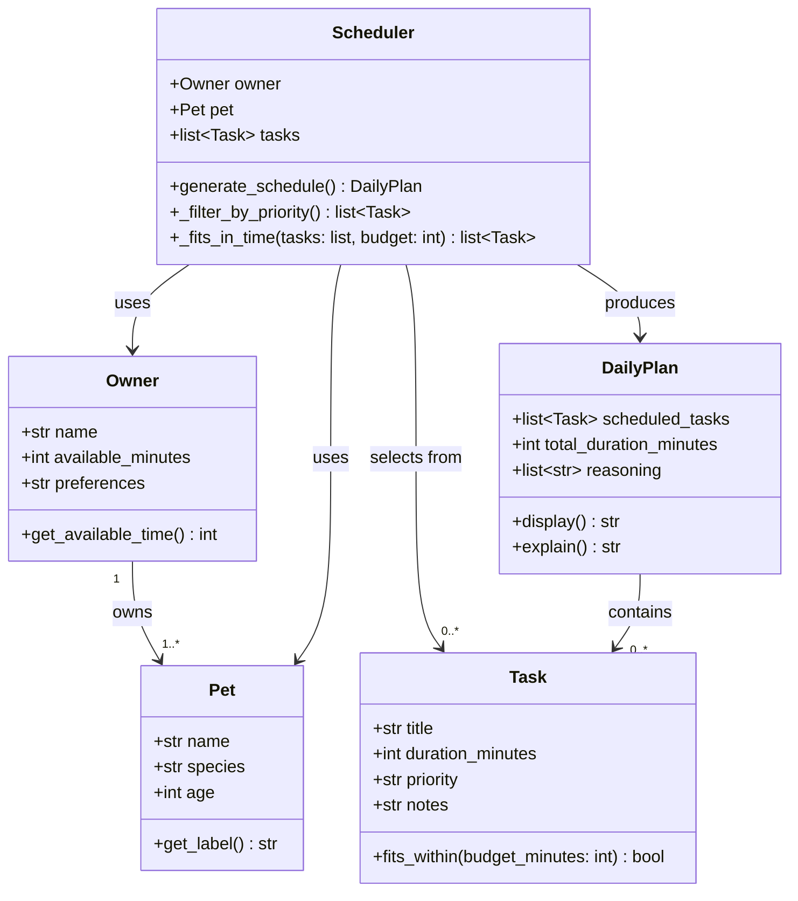

# PawPal+ Project Reflection

## 1. System Design

**a. Initial design**

PawPal+ supports three core user actions:

1. **Enter owner and pet info** — The user provides basic details such as their name, their pet's name, and the pet's species. This information personalizes the planning experience and allows the system to apply relevant defaults or constraints (e.g., species-specific care needs).

2. **Add and manage care tasks** — The user defines the tasks that need to happen during the day (e.g., morning walk, feeding, medication, grooming). Each task has a title, an estimated duration in minutes, and a priority level (low, medium, or high). Users can add multiple tasks and edit or remove them as needed.

3. **Generate a daily schedule** — The user triggers the scheduler, which selects and orders tasks based on the owner's available time and each task's priority. The system produces a plan for the day and explains its reasoning — why each task was included, skipped, or placed at a particular time.

My initial UML included five classes: `Owner`, `Pet`, `Task`, `Scheduler`, and `DailyPlan`. `Owner` held the time budget and preferences, `Pet` stored basic animal info, and `Task` represented a single care activity with a title, duration, and priority. `Scheduler` was the brain — it took the owner and pet as inputs and returned a `DailyPlan`, which held the ordered list of selected tasks and a reasoning string. The main relationships were that `Owner` owned `Pet`, and `Scheduler` used both to produce a `DailyPlan`.

**UML Class Diagram (draft)**

**b. Design changes**

Yes, the design changed quite a bit once I started actually writing the code and testing it. Four main things shifted:

1. **Added a `Priority` enum (replaces raw string)** — The initial design used a plain string (`"low"`, `"medium"`, `"high"`) for `Task.priority`. Strings don't sort naturally in priority order (`"high" < "low" < "medium"` alphabetically), which would silently produce wrong results in `_filter_by_priority`. Replacing it with a `Priority(Enum)` with integer values (LOW=1, MEDIUM=2, HIGH=3) makes sorting unambiguous and prevents invalid values from being passed in.

2. **Added `pet` attribute to `Owner`** — The UML showed an `Owner "1" --> "1..*" Pet` relationship, but the skeleton had no `pet` field on `Owner`. Without it, the only way to get from an owner to their pet was through `Scheduler`, which shouldn't be the sole path. Adding `pets: list[Pet]` to `Owner` closes this gap and also allowed the system to support multiple pets per owner.

3. **Added `skipped_tasks` and `skipped_reasons` to `DailyPlan`** — The original design stated the plan should explain why tasks were skipped, but `DailyPlan` only stored `scheduled_tasks`. There was no structure to hold tasks that didn't make the cut. Adding `skipped_tasks: list[Task]` and `skipped_reasons: list[str]` gives `explain()` the data it needs to produce a complete explanation.

4. **Clarified that `Scheduler.generate_schedule` owns reasoning population** — It was ambiguous whether `Scheduler` or `DailyPlan.explain()` was responsible for generating the reasoning strings. I decided `Scheduler` should write them since it has all the context at decision time, and `explain()` just formats what it receives.

---

## 2. Scheduling Logic and Tradeoffs

**a. Constraints and priorities**

The scheduler considers two main constraints: the owner's **available time** (in minutes) and each task's **priority level**. Tasks also have a `due_date` field, so only tasks due today or earlier are included in the schedule — future recurring tasks are automatically filtered out.

I decided time and priority were the most important constraints because they directly reflect a real pet owner's situation. You only have so many minutes in a day, and some tasks like medication genuinely can't be skipped. Preferences like "mornings only" are stored but don't yet affect scheduling logic — that would be a natural next step.

**b. Tradeoffs**

The scheduler uses a **greedy algorithm**: it sorts all tasks by priority (and duration as a tiebreaker), then picks them one by one until the time budget runs out. This means it doesn't look ahead — if a 60-minute low-priority task fills the entire budget, two 10-minute high-priority tasks that came after it in the list would still get skipped.

In practice this doesn't happen because high-priority tasks are sorted to the front first. But the greedy approach does mean the schedule isn't globally optimal — it won't rearrange tasks to fit in the maximum number. For a daily pet care app, I think this is a reasonable tradeoff. The output is predictable and easy to explain, which matters more than squeezing in one extra task.

---

## 3. AI Collaboration

**a. How you used AI**

I used AI throughout the project — mainly for design brainstorming at the start, then for catching logic gaps I missed, and later for helping structure the Streamlit UI sections. The most useful prompts were specific ones: asking it to review my UML against the skeleton and list what was missing, or asking it to explain why a particular sort wouldn't work before writing the fix. Asking broad questions like "how do I build a scheduler?" was less useful than asking "what happens when I sort these strings alphabetically?"

**b. Judgment and verification**

One moment where I didn't take the suggestion as-is was when AI initially added `pet` as `Optional[Pet]` (a single pet) on `Owner`. The UML I had drawn showed a one-to-many relationship, and I knew I wanted to support multiple pets, so I changed it to `list[Pet]` instead. I verified by checking the `Scheduler` logic — `get_all_tasks()` needed to loop over multiple pets, which only made sense if `Owner` held a list. Running `main.py` with two pets (Mochi and Luna) confirmed the change worked correctly end to end.

---

## 4. Testing and Verification

**a. What you tested**

I wrote 8 tests covering both happy paths and edge cases:

- **Task completion** — `mark_complete()` flips `completed` to `True`
- **Task addition** — `add_task()` increases a pet's task count
- **Time budget** — tasks beyond the budget land in `skipped_tasks`, not the schedule
- **Priority ordering** — HIGH tasks appear before MEDIUM, which appear before LOW
- **Recurring task recurrence** — completing a daily task spawns a new one due tomorrow
- **Empty owner** — no tasks means an empty plan with no crash
- **Conflict detection** — two tasks at the same time produce a warning string
- **Non-recurring tasks** — `as-needed` tasks don't spawn a next occurrence

These tests mattered because the scheduler logic has several moving parts — sorting, filtering, time arithmetic, and recurrence — and a bug in any one of them wouldn't necessarily cause a crash, just a silently wrong schedule.

**b. Confidence**

I'm fairly confident the core scheduling logic is correct for the scenarios I tested. The greedy selection, priority sort, and recurring task automation all have direct test coverage. I'm less confident about edge cases around time formatting — for example, what happens if a task is added without a start time after the schedule is generated, or if `available_minutes` is set to 0. If I had more time I'd test those boundary conditions, and also test that `filter_tasks` correctly combines both filters at once rather than just each filter individually.

---

## 5. Reflection

**a. What went well**

I'm most satisfied with how the recurring task system turned out. Using `dataclasses.replace()` combined with `timedelta` kept the implementation really clean — one method on `Task` handles the date math, and `Scheduler.mark_task_complete` handles when to call it. It ended up being much simpler than I expected, and the Streamlit UI could surface the result directly with a single `st.info` message.

**b. What you would improve**

If I had another iteration, I'd add proper time-slot scheduling — letting the owner define when they're available (e.g., 8am–10am, 5pm–7pm) rather than just a flat minute budget. That would make conflict detection genuinely useful day-to-day rather than just a safety check. I'd also want to persist data between sessions, either with a local JSON file or a simple database, because right now everything resets when the Streamlit app reloads.

**c. Key takeaway**

The biggest thing I learned is that designing a system on paper and implementing it are two very different things — not because the design was wrong, but because the gaps only become visible when you actually try to wire the pieces together. The `Priority` string bug, the missing `skipped_tasks` field, the ambiguous reasoning ownership — none of those were obvious from the UML. Writing the skeleton first and then questioning it before filling in any logic was the step that caught most of those issues early, which saved a lot of rework later.
