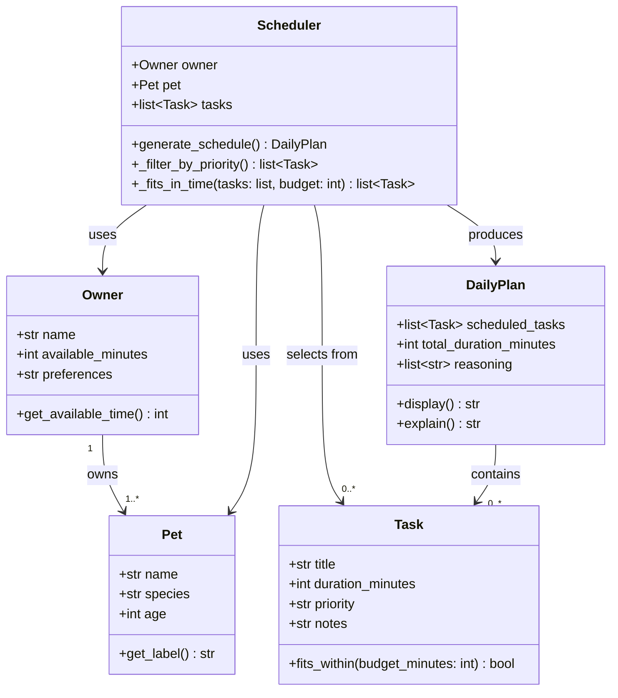

# PawPal+ Project Reflection

## 1. System Design

**a. Initial design**

PawPal+ supports three core user actions:

1. **Enter owner and pet info** — The user provides basic details such as their name, their pet's name, and the pet's species. This information personalizes the planning experience and allows the system to apply relevant defaults or constraints (e.g., species-specific care needs).

2. **Add and manage care tasks** — The user defines the tasks that need to happen during the day (e.g., morning walk, feeding, medication, grooming). Each task has a title, an estimated duration in minutes, and a priority level (low, medium, or high). Users can add multiple tasks and edit or remove them as needed.

3. **Generate a daily schedule** — The user triggers the scheduler, which selects and orders tasks based on the owner's available time and each task's priority. The system produces a plan for the day and explains its reasoning — why each task was included, skipped, or placed at a particular time.

- Briefly describe your initial UML design.
- What classes did you include, and what responsibilities did you assign to each?

**UML Class Diagram (draft)**

**b. Design changes**

- Did your design change during implementation?
- If yes, describe at least one change and why you made it.

Four changes were made after reviewing the initial UML against the skeleton for correctness and completeness:

1. **Added a `Priority` enum (replaces raw string)** — The initial design used a plain string (`"low"`, `"medium"`, `"high"`) for `Task.priority`. Strings don't sort naturally in priority order (`"high" < "low" < "medium"` alphabetically), which would silently produce wrong results in `_filter_by_priority`. Replacing it with a `Priority(Enum)` with integer values (LOW=1, MEDIUM=2, HIGH=3) makes sorting unambiguous and prevents invalid values from being passed in.

2. **Added `pet` attribute to `Owner`** — The UML showed an `Owner "1" --> "1..*" Pet` relationship, but the skeleton had no `pet` field on `Owner`. Without it, the only way to get from an owner to their pet was through `Scheduler`, which shouldn't be the sole path. Adding `pet: Optional[Pet]` to `Owner` closes this gap.

3. **Added `skipped_tasks` and `skipped_reasons` to `DailyPlan`** — The original design stated the plan should explain why tasks were skipped, but `DailyPlan` only stored `scheduled_tasks`. There was no structure to hold tasks that didn't make the cut. Adding `skipped_tasks: list[Task]` and `skipped_reasons: list[str]` gives `explain()` the data it needs to produce a complete explanation.

4. **Clarified that `Scheduler.generate_schedule` owns reasoning population** — It was ambiguous whether `Scheduler` or `DailyPlan.explain()` was responsible for generating the reasoning strings. The docstring now explicitly states that `generate_schedule` builds and writes reasoning for both included and skipped tasks into `DailyPlan`, making the responsibility clear before implementation begins.

---

## 2. Scheduling Logic and Tradeoffs

**a. Constraints and priorities**

- What constraints does your scheduler consider (for example: time, priority, preferences)?
- How did you decide which constraints mattered most?

**b. Tradeoffs**

- Describe one tradeoff your scheduler makes.
- Why is that tradeoff reasonable for this scenario?

---

## 3. AI Collaboration

**a. How you used AI**

- How did you use AI tools during this project (for example: design brainstorming, debugging, refactoring)?
- What kinds of prompts or questions were most helpful?

**b. Judgment and verification**

- Describe one moment where you did not accept an AI suggestion as-is.
- How did you evaluate or verify what the AI suggested?

---

## 4. Testing and Verification

**a. What you tested**

- What behaviors did you test?
- Why were these tests important?

**b. Confidence**

- How confident are you that your scheduler works correctly?
- What edge cases would you test next if you had more time?

---

## 5. Reflection

**a. What went well**

- What part of this project are you most satisfied with?

**b. What you would improve**

- If you had another iteration, what would you improve or redesign?

**c. Key takeaway**

- What is one important thing you learned about designing systems or working with AI on this project?
